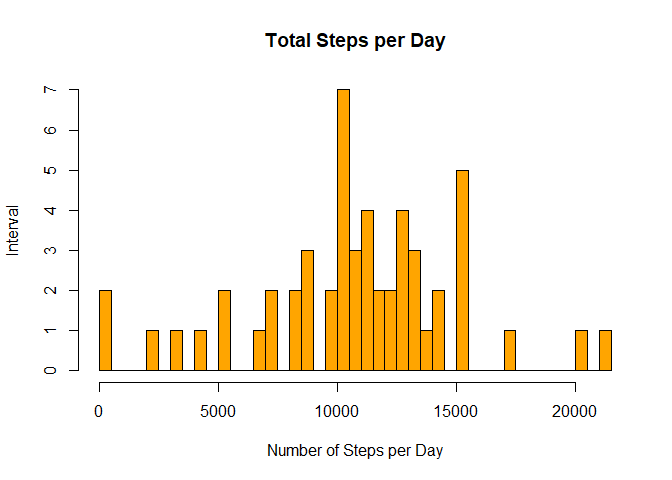
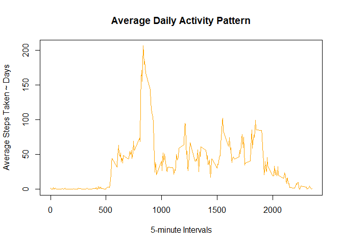
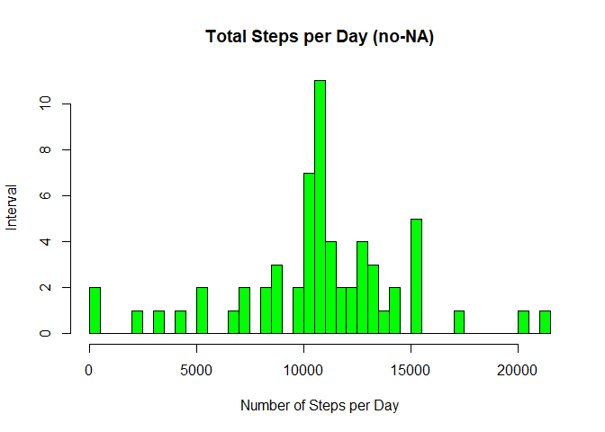
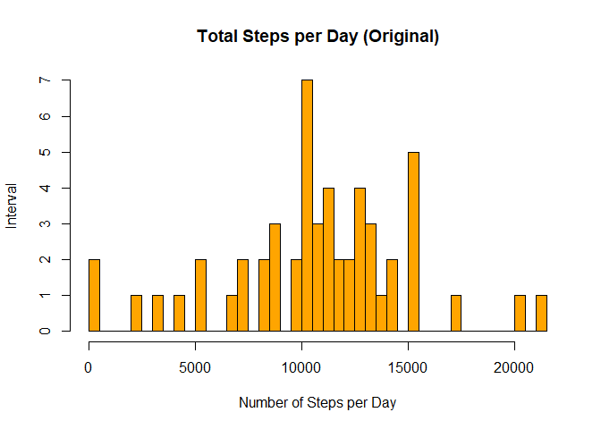
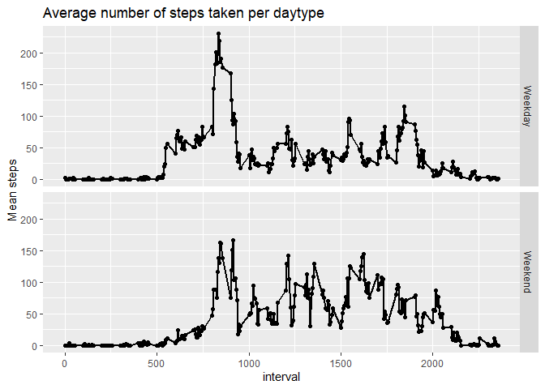

# Loading required packages into R

```r
library(knitr)
library(ggplot2)
library(dplyr)
```

```
## 
## Attaching package: 'dplyr'
```

```
## The following objects are masked from 'package:stats':
## 
##     filter, lag
```

```
## The following objects are masked from 'package:base':
## 
##     intersect, setdiff, setequal, union
```

```r
library(plyr)
```

```
## ------------------------------------------------------------------------------
```

```
## You have loaded plyr after dplyr - this is likely to cause problems.
## If you need functions from both plyr and dplyr, please load plyr first, then dplyr:
## library(plyr); library(dplyr)
```

```
## ------------------------------------------------------------------------------
```

```
## 
## Attaching package: 'plyr'
```

```
## The following objects are masked from 'package:dplyr':
## 
##     arrange, count, desc, failwith, id, mutate, rename, summarise,
##     summarize
```

# Reading the dataset and processing the data
activity.csv and checking first part of file

```r
activity <- read.csv("activity.csv")

totalstepsperday <- aggregate(steps ~ date, data = activity, FUN = sum, na.rm = TRUE)
head(totalstepsperday)
```

```
##         date steps
## 1 2012-10-02   126
## 2 2012-10-03 11352
## 3 2012-10-04 12116
## 4 2012-10-05 13294
## 5 2012-10-06 15420
## 6 2012-10-07 11015
```

converting dates to Y-M-D format

```r
activity$date <- as.Date(activity$date, "%Y-%m-%d")
```

# Creating a histogram with 'total number of steps'
calculate steps as it relates to date using SUM (per day)

```r
hist(totalstepsperday$steps, 
     main="Total Steps per Day", 
     xlab="Number of Steps per Day", 
     ylab = "Interval",
     col="orange",
     breaks=50)
```

<!-- -->

# Calculate Mean and Median number of steps taken each day
mean of total steps per day

```r
msteps <- mean(totalstepsperday$steps)
msteps
```

```
## [1] 10766.19
```

median of total steps per day

```r
medsteps <- median(totalstepsperday$steps)
medsteps
```

```
## [1] 10765
```

check work using summary

```r
summary(totalstepsperday)
```

```
##      date               steps      
##  Length:53          Min.   :   41  
##  Class :character   1st Qu.: 8841  
##  Mode  :character   Median :10765  
##                     Mean   :10766  
##                     3rd Qu.:13294  
##                     Max.   :21194
```

# Create time-series plot for average number of steps taken
five minute average using steps to interval - FUN = mean instead of sum

```r
fivemin <- aggregate(steps ~ interval, data = activity, FUN = mean, na.rm = TRUE)
```

line chart

```r
plot(x = fivemin$interval, 
     y = fivemin$steps, 
     type = "l", 
     col = "orange",
     xlab = "5-minute Intervals",
     ylab = "Average Steps Taken ~ Days",
     main = "Average Daily Activity Pattern")
```

<!-- -->
Find 5-minute interval with most steps taken

```r
maxsteps <- fivemin$interval[which.max(fivemin$steps)]
maxsteps
```

```
## [1] 835
```
# Strategy for imputing missing data
Using mean value to replace NA

```r
activity2 <- activity
nas <- is.na(activity2$steps)
avg_interval <- tapply(activity2$steps, activity2$interval, mean, na.rm=TRUE, simplify = TRUE)
activity2$steps[nas] <- avg_interval[as.character(activity2$interval[nas])]
names(activity2)
```

```
## [1] "steps"    "date"     "interval"
```

Check for no-NA

```r
sum(is.na(activity2))
```

```
## [1] 0
```


# Create histogram for no-NA data
Setting up the pannel for one row and two columns

```r
par(mfrow=c(1,2))
```

Similar analysis without NAs now

```r
totalstepsperday2 <- aggregate(steps ~ date, data = activity2, FUN = sum, na.rm = TRUE)
head(totalstepsperday2)
```

```
##         date    steps
## 1 2012-10-01 10766.19
## 2 2012-10-02   126.00
## 3 2012-10-03 11352.00
## 4 2012-10-04 12116.00
## 5 2012-10-05 13294.00
## 6 2012-10-06 15420.00
```

Histogram without the NA values

```r
hist(totalstepsperday2$steps, 
     main = "Total Steps per Day (no-NA)", 
     xlab = "Number of Steps per Day", 
     ylab = "Interval",
     col="green",
     breaks=50)
```

<!-- -->

Histogram with the orginal dataset

```r
hist(totalstepsperday$steps, 
     main="Total Steps per Day (Original)", 
     xlab="Number of Steps per Day", 
     ylab = "Interval",
     col="orange",
     breaks=50)
```

<!-- -->

Resetting the panel

```r
par(mfrow=c(1,1))
```

What is the impact of imputing data?

```r
summary(totalstepsperday)
```

```
##      date               steps      
##  Length:53          Min.   :   41  
##  Class :character   1st Qu.: 8841  
##  Mode  :character   Median :10765  
##                     Mean   :10766  
##                     3rd Qu.:13294  
##                     Max.   :21194
```

```r
summary(totalstepsperday2)
```

```
##       date                steps      
##  Min.   :2012-10-01   Min.   :   41  
##  1st Qu.:2012-10-16   1st Qu.: 9819  
##  Median :2012-10-31   Median :10766  
##  Mean   :2012-10-31   Mean   :10766  
##  3rd Qu.:2012-11-15   3rd Qu.:12811  
##  Max.   :2012-11-30   Max.   :21194
```

# Create panel plot to compare steps during the week or weekend
Add the new weekend/weekday field

```r
activity2<- activity2%>%
        mutate(typeofday= ifelse(weekdays(activity2$date)=="Saturday" | weekdays(activity2$date)=="Sunday", "Weekend", "Weekday"))
head(activity2)
```

```
##       steps       date interval typeofday
## 1 1.7169811 2012-10-01        0   Weekday
## 2 0.3396226 2012-10-01        5   Weekday
## 3 0.1320755 2012-10-01       10   Weekday
## 4 0.1509434 2012-10-01       15   Weekday
## 5 0.0754717 2012-10-01       20   Weekday
## 6 2.0943396 2012-10-01       25   Weekday
```
Plot - Line chart

```r
fivemin2<- aggregate(steps ~ interval + typeofday, data = activity2, FUN = mean)
head(fivemin2)
```

```
##   interval typeofday      steps
## 1        0   Weekday 2.25115304
## 2        5   Weekday 0.44528302
## 3       10   Weekday 0.17316562
## 4       15   Weekday 0.19790356
## 5       20   Weekday 0.09895178
## 6       25   Weekday 1.59035639
```

```r
g <- qplot(interval, steps, data = fivemin2, facets = typeofday~.)
g + geom_line(size = 1) + ylab("Mean steps") + ggtitle("Average number of steps taken per daytype")
```

<!-- -->
